# Ha's Journal

## Week 1 

#### Day: 11/08/2021

* Works:
    * Reorganize project journal
#### Day: 11/13/2021
    
* Update project board and pick up some tasks for this week

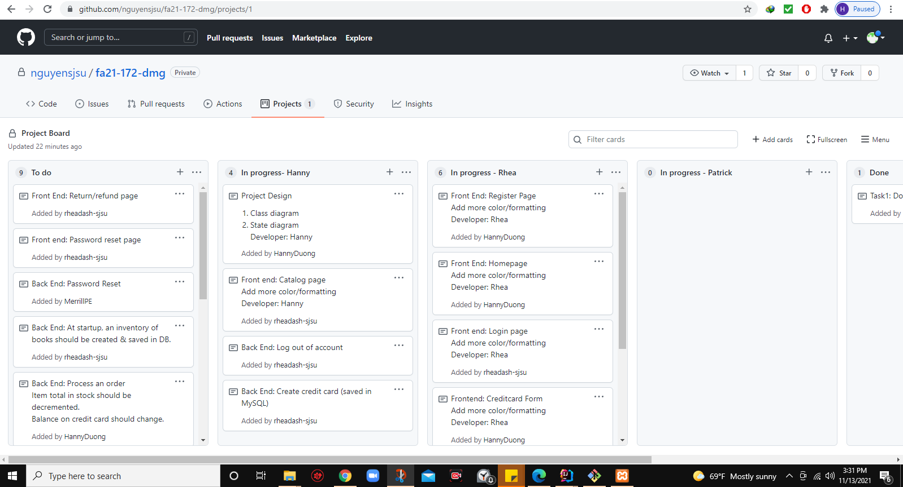

&nbsp;

* Draw a simple class diagram
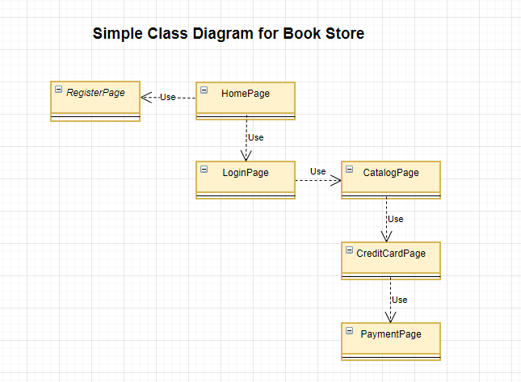

&nbsp;

* Draw a state diagram 
 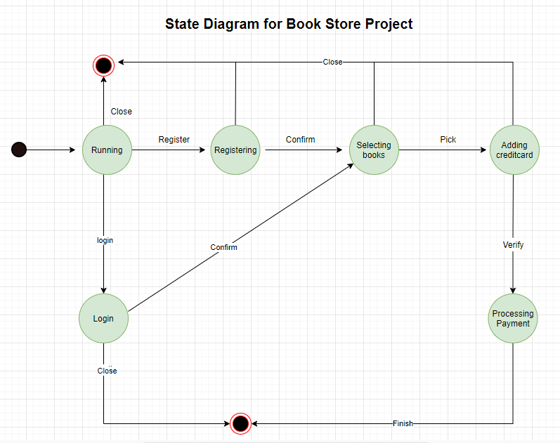

&nbsp;

* Issue: cannot display local images to the catalog page
* Solution: move the images' folder from templates to static folder
* spring-payments/src/main/resources/static/images

* Working on catalog page
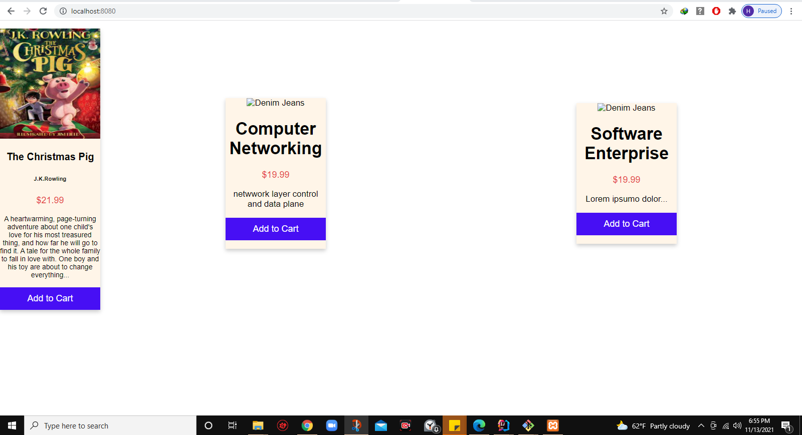

&nbsp;

* Create Config.java for routing between pages
* Create navigation.html
  * Challenge: losing css style of navigation.html when insert to catalog.html
  * Solution: need to add th:fragment attribute in header of navigation.html also
  * Reference : https://www.baeldung.com/spring-thymeleaf-fragments

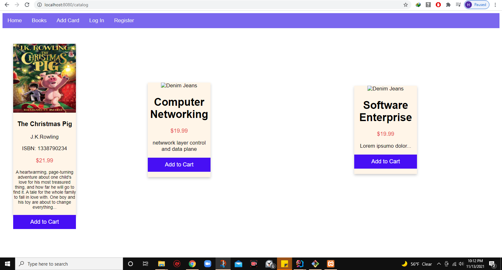

&nbsp;

## Week 2

### Day: 11/14/2021
* Finish style catalog page

&nbsp;

* Pick new task
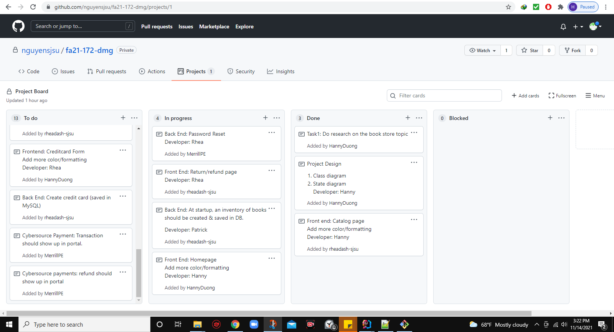

&nbsp;

### Day: 11/16/2021
* Finish style home page
  

&nbsp;

* Pick new task
  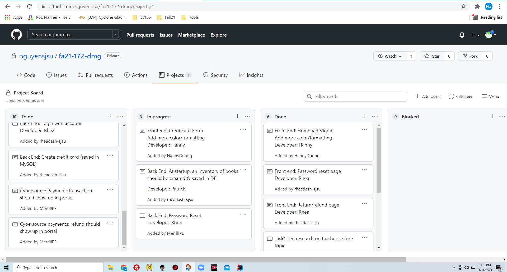

&nbsp;

### Day: 11/18/2021
* Re-structure the code as microservices
	* Created three separate services:
		* Spring-user
		* Spring-books
		* Spring-payments

### Day: 11/19/2021
##### Try to figure out how to navigate to a view in different packages

  * Spring Annotations: https://www.baeldung.com/spring-componentscan-vs-enableautoconfiguration
    * We can use Spring Bean annotations on classes and methods to define beans.
    * After that the Spring IoC container configures and manages the beans
    
    ##### @ComponentScan: 
    * scans for annotated Spring components
    * used with **@Configuration** annotation to specify the package for Spring to scan for components
    * @ComponentScan without arguments tells Spring to scan the current package and all of its sub-packages.
    * @ComponentScan = @ComponentScan(basePackages = "com.x.x.x")
      * ex: @ComponentScan(basePackages = "com.example.springusers")
    * The basePackages argument is a package or an array of packages for scanning
    * @ComponentScan can be customized for specific packages
      * @ComponentScan(basePackages = "com.example.springpayments")
    * We can use @ComponentScan together with @SpringBootApplication
   
    ##### @EnableAutoConfiguration:
    * is used to enable the auto-configuration
    * makes Spring Boot create many beans automatically, relying on the dependencies

     ##### The main application class is also a bean
    * The main application class and the configuration class are not necessarily the same.
    * If they are different, it does not matter where we put the main application class.
    * Only the location of the configuration class matters
    * As component scanning starts from its package by default

    ###### @SpringBootApplication annotation
    * it is a combination of three annotations:
      * @Configuration
      * @EnableAutoConfiguration
      * @ComponentScan
  * We should avoid putting the @Configuration class in the default package.
  Otherwise, Spring scans all the classes in all jars in a classpath,
  which causes errors and the application probably does not start.

#### What is Spring MVC
* Spring MVC is a module of the Spring framework dealing with the Model-View-Controller or MVC pattern
* Spring implements MVC with the front controller pattern using its DispatcherServlet
* The DispatcherServlet acts as the main controller to route requests to their intended destination
* Model is the data of our application
* The View is represented by various template engines
* **To enable Spring MVC support through a Java configuration class, we must add the @EnableWebMvc annotation**
  * @EnableWebMvc: set up the basic support needed for an MVC project such as
    * Registering controllers and mapping
    * Type converters
    * validation support
    * message converters 
    * exception handling
  * If we want to customize the default configuration, we need to implement the WebMvcConfigure interface
  * The ViewControllerRegistry allows us to register view controllers that create a direct mapping
  between the URL and the view name.
  * We can **scan controller classes** using @ComponentScan with the package that contains the controllers

#### Spring MVC with Boot
* Spring Boot is an addition to Spring Platform
* Boot is not intended to replace Spring, but to make working with it faster and easier.
* Spring Boot Starters will take care of dependency management

#### Spring Boot Entry Point
* Each application built using Spring Boot needs merely to define the main entry point.
* Usually the main entry point is a Java class with the main method, annotated with @SpringBootApplication.
* With Spring Boot we can set up frontend using Thymeleaf or JSP
  * Adding "spring-boot-starter-thymeleaf" dependency to enable Thymeleaf
  

#### What is front controller pattern
* Reference: https://www.baeldung.com/java-front-controller-pattern
* Front Controller is defines as a controller that handles all requests for aWeb site.
* The font controller consolidates all requests handling by channeling requests through a single handler object
* The font controller pattern is mainly divided into two parts:
  * A single dispatching controller
  * A hierarchy of commands
  
#### Thymeleaf
* Thymeleaf is a template engine 
* Spring Boot provides a default location where it expects to find templates (resources/templates)

#### Microservices with Spring
* Reference: https://spring.io/blog/2015/07/14/microservices-with-spring
* Microservices allow large systems to built up from a number of collaborating components.

##### End today work : Cannot find a way to handle view in different packages

### Day: 11/20/2021
* Fixing No mapping to image and loss of css style
  * Solution: Do not use @EnableWebMvc
* @EnableWebMvc annotation is used for enabling Spring MVC in an application and works by importing the Spring MVC Configuration
from WebMvcConfigurationSupport.
* But I do not know why when using this annotation will cause of losing 
css style and no mapping to image

* Adding app's name on top of the navigation bar

##### Working on spring-payment
* Adding process_payment.html
* Creating user's address form and credit card form

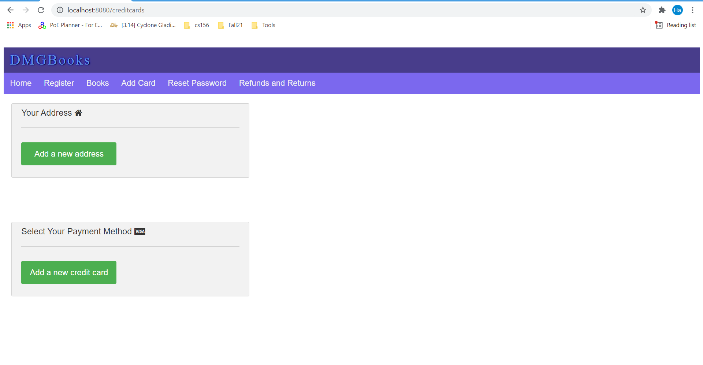

&nbsp;

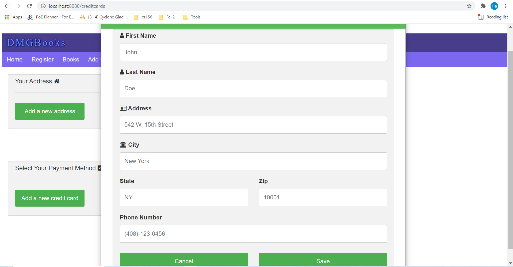

&nbsp;

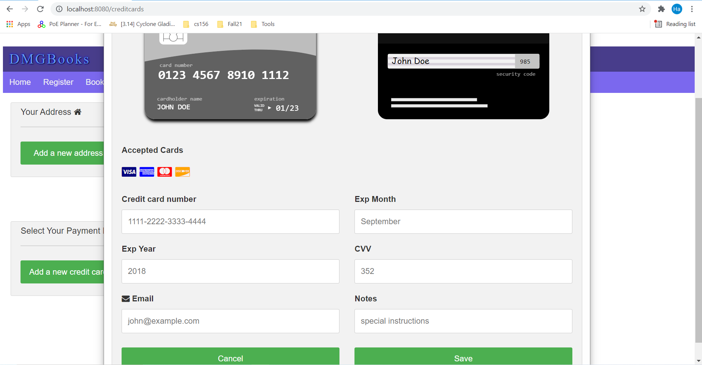

&nbsp;

### Day: 11/21/2021
* Work on taking user's address and credit card info and display them

#### Handling the command object
* Reference: https://www.thymeleaf.org/doc/tutorials/2.1/thymeleafspring.html
* Command object is the name Spring MVC gives to form-backing beans.
* That is, to objects that model a form's fields and provide getter and setter methods
* That will be used by the framework for establishing and obtaining the values input by the user at the browser side
* Thymeleaf requires to **specify the command object by using a th:object attribute** in <form> tag
* Values for **th:object attributes** must be **variable expressions(${...})** specifying the name of a model attribute

* th:field attribute
  * binding input with a property in the form -backing bean
  * Values for the th:field attributes must be selection expressions(*{...})
  * Ex: th:field="*{datePlanted}"
  
### Day : 11/22/2022

* Continue on handling the command object
* String concatenation with Thymeleaf: https://www.wimdeblauwe.com/blog/2021/01/11/string-concatenation-with-thymeleaf/
* Credit card: https://developer.cybersource.com/hello-world/testing-guide-v1.html
* Get shipping information, authorize credit card, and stored in MySQL

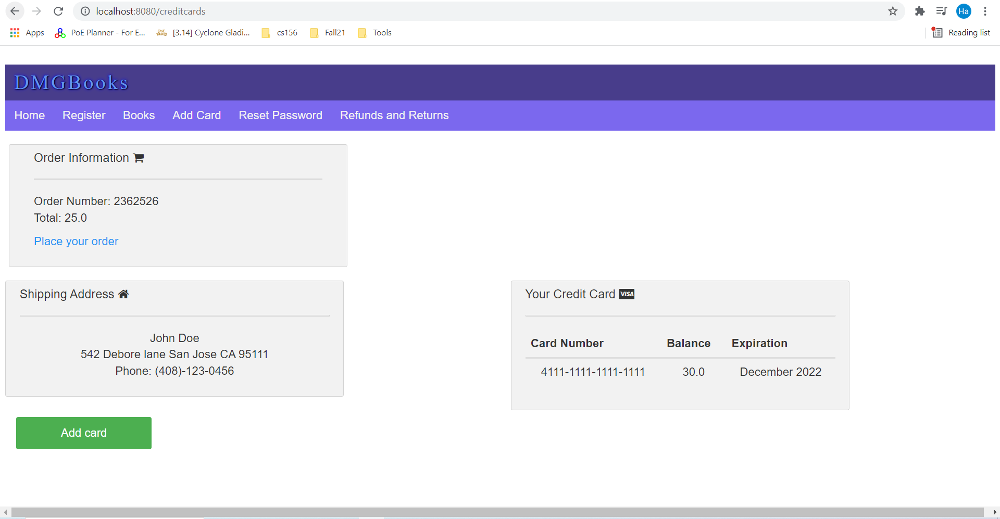

&nbsp;

