# Ha's Journal

## Week 1 

#### Day: 11/08/2021

* Works:
    * Reorganize project journal
#### Day: 11/13/2021
    
* Update project board and pick up some tasks for this week

&nbsp;

* Draw a simple class diagram

&nbsp;

* Draw a state diagram 
 

&nbsp;

* Issue: cannot display local images to the catalog page
* Solution: move the images' folder from templates to static folder
* spring-payments/src/main/resources/static/images

* Working on catalog page

&nbsp;

* Create Config.java for routing between pages
* Create navigation.html
  * Challenge: losing css style of navigation.html when insert to catalog.html
  * Solution: need to add th:fragment attribute in header of navigation.html also
  * Reference : https://www.baeldung.com/spring-thymeleaf-fragments

&nbsp;

## Week 2

### Day: 11/14/2021
* Finish style catalog page

&nbsp;

* Pick new task

&nbsp;

### Day: 11/16/2021
* Finish style home page
  

&nbsp;

* Pick new task
  

&nbsp;

### Day: 11/18/2021
* Re-structure the code as microservices
	* Created three separate services:
		* Spring-user
		* Spring-books
		* Spring-payments

### Day: 11/19/2021
##### Try to figure out how to navigate to a view in different packages

  * Spring Annotations: https://www.baeldung.com/spring-componentscan-vs-enableautoconfiguration
    * We can use Spring Bean annotations on classes and methods to define beans.
    * After that the Spring IoC container configures and manages the beans
    
    ##### @ComponentScan: 
    * scans for annotated Spring components
    * used with **@Configuration** annotation to specify the package for Spring to scan for components
    * @ComponentScan without arguments tells Spring to scan the current package and all of its sub-packages.
    * @ComponentScan = @ComponentScan(basePackages = "com.x.x.x")
      * ex: @ComponentScan(basePackages = "com.example.springusers")
    * The basePackages argument is a package or an array of packages for scanning
    * @ComponentScan can be customized for specific packages
      * @ComponentScan(basePackages = "com.example.springpayments")
    * We can use @ComponentScan together with @SpringBootApplication
   
    ##### @EnableAutoConfiguration:
    * is used to enable the auto-configuration
    * makes Spring Boot create many beans automatically, relying on the dependencies

     ##### The main application class is also a bean
    * The main application class and the configuration class are not necessarily the same.
    * If they are different, it does not matter where we put the main application class.
    * Only the location of the configuration class matters
    * As component scanning starts from its package by default

    ###### @SpringBootApplication annotation
    * it is a combination of three annotations:
      * @Configuration
      * @EnableAutoConfiguration
      * @ComponentScan
  * We should avoid putting the @Configuration class in the default package.
  Otherwise, Spring scans all the classes in all jars in a classpath,
  which causes errors and the application probably does not start.

#### What is Spring MVC
* Spring MVC is a module of the Spring framework dealing with the Model-View-Controller or MVC pattern
* Spring implements MVC with the front controller pattern using its DispatcherServlet
* The DispatcherServlet acts as the main controller to route requests to their intended destination
* Model is the data of our application
* The View is represented by various template engines
* **To enable Spring MVC support through a Java configuration class, we must add the @EnableWebMvc annotation**
  * @EnableWebMvc: set up the basic support needed for an MVC project such as
    * Registering controllers and mapping
    * Type converters
    * validation support
    * message converters 
    * exception handling
  * If we want to customize the default configuration, we need to implement the WebMvcConfigure interface
  * The ViewControllerRegistry allows us to register view controllers that create a direct mapping
  between the URL and the view name.
  * We can **scan controller classes** using @ComponentScan with the package that contains the controllers

#### Spring MVC with Boot
* Spring Boot is an addition to Spring Platform
* Boot is not intended to replace Spring, but to make working with it faster and easier.
* Spring Boot Starters will take care of dependency management

#### Spring Boot Entry Point
* Each application built using Spring Boot needs merely to define the main entry point.
* Usually the main entry point is a Java class with the main method, annotated with @SpringBootApplication.
* With Spring Boot we can set up frontend using Thymeleaf or JSP
  * Adding "spring-boot-starter-thymeleaf" dependency to enable Thymeleaf
  

#### What is front controller pattern
* Reference: https://www.baeldung.com/java-front-controller-pattern
* Front Controller is defines as a controller that handles all requests for aWeb site.
* The font controller consolidates all requests handling by channeling requests through a single handler object
* The font controller pattern is mainly divided into two parts:
  * A single dispatching controller
  * A hierarchy of commands
  
#### Thymeleaf
* Thymeleaf is a template engine 
* Spring Boot provides a default location where it expects to find templates (resources/templates)

#### Microservices with Spring
* Reference: https://spring.io/blog/2015/07/14/microservices-with-spring
* Microservices allow large systems to built up from a number of collaborating components.

##### End today work : Cannot find a way to handle view in different packages

### Day: 11/20/2021
* Fixing No mapping to image and loss of css style
  * Solution: Do not use @EnableWebMvc
* @EnableWebMvc annotation is used for enabling Spring MVC in an application and works by importing the Spring MVC Configuration
from WebMvcConfigurationSupport.
* But I do not know why when using this annotation will cause of losing 
css style and no mapping to image

* Adding app's name on top of the navigation bar

##### Working on spring-payment
* Adding process_payment.html
* Creating user's address form and credit card form

&nbsp;

&nbsp;

&nbsp;

### Day: 11/21/2021
* Work on taking user's address and credit card info and display them

 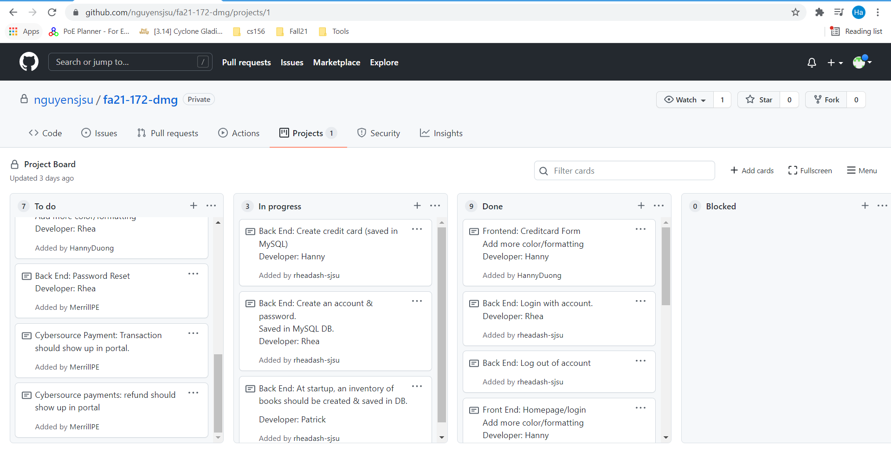

&nbsp;

#### Handling the command object
* Reference: https://www.thymeleaf.org/doc/tutorials/2.1/thymeleafspring.html
* Command object is the name Spring MVC gives to form-backing beans.
* That is, to objects that model a form's fields and provide getter and setter methods
* That will be used by the framework for establishing and obtaining the values input by the user at the browser side
* Thymeleaf requires to **specify the command object by using a th:object attribute** in <form> tag
* Values for **th:object attributes** must be **variable expressions(${...})** specifying the name of a model attribute

* th:field attribute
  * binding input with a property in the form -backing bean
  * Values for the th:field attributes must be selection expressions(*{...})
  * Ex: th:field="*{datePlanted}"
 
## Week 3

### Day : 11/22/2022

* Continue on handling the command object
* String concatenation with Thymeleaf: https://www.wimdeblauwe.com/blog/2021/01/11/string-concatenation-with-thymeleaf/
* Credit card: https://developer.cybersource.com/hello-world/testing-guide-v1.html
* Get shipping information, authorize credit card, and stored in MySQL

&nbsp;

### Day : 11/23/2022

* Task:
* Process an order
 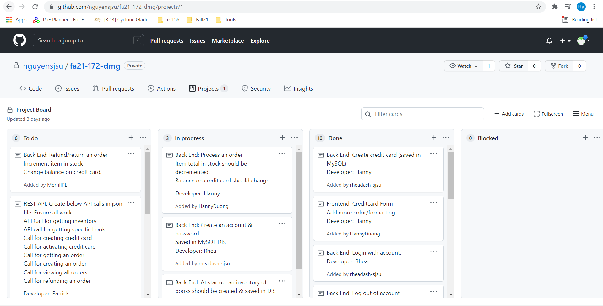

&nbsp;

  * Process payment result
 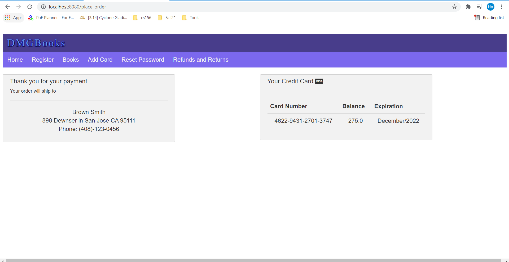

&nbsp;

### Day : 11/24/2022

* Task
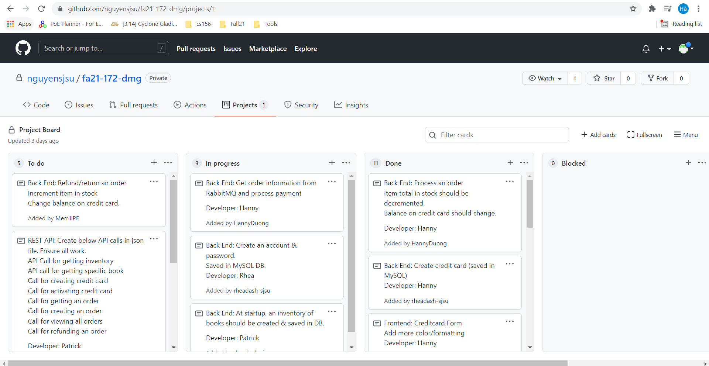

&nbsp;

* Try to figure out how to navigate to view in different modules
* @Controller and @RestController
* Reference: https://www.baeldung.com/spring-controller-vs-restcontroller
* @Controller annotation is a classic controller, which is a specialization of the @Component class
* @Component allows us to auto-detect implementation classes through the classpath scanning.
* We typically use @Controller in combination with a @RequestMapping annotation for request handling methods
* @ResponseBody enables automatic serialization of the return object into the HttpResponse  

* @RestController is a specialized version of the controller
* @RestController is used to simplify the creation of RESTful web services.
  * It combines @Controller and @ResponseBody to eliminates the need to annotate every request handling method
    of the controller class with the @ResponseBody annotation.
  * The @ResponseBody is not required when using @RestController
  * Every request  handling method of the controller class automatically serializes return objects into HttpResponse

* What are RESTful Web Services?
  * Reference: https://docs.oracle.com/javaee/6/tutorial/doc/gijqy.html
  * RESTful web services are built to work best on the Web.
  * Representational State Transfer(REST) is an architecture style that specifies constraints,
  such as performance, scalability, and modifiability, that enable services to work best on the Web.
  * In the REST architecture style , **data and functionality are considered resources** and are accessed using Uniform Resource Identifies(URIs)- links on the Web
    * Clients and servers exchange representations of resources by using a standardized interface and 
      a stateless communication protocol-HTTP
  * Principles in RESTful applications:
    * Resources identification through URI:
      * A RESTful web service exposes a set of resources that identify the targets of the interaction with its clients.
      * Resources are identified by URIs, which provide a global addressing space for resource and service discovery.
    * Uniform interface:
      * Resources are manipulated using a fixed set of four create, read, update, and delete operations:
        * PUT, GET, POST, DELETE
          * PUT creates a new resource
          * GET retrieves the current state of a resource in some representation
          * POST transfer a new state onto a resource.

* REST is a set of architectural constraints, not a protocol or a standard
* In RESTful web services, HTTP requests are handled by a controller.

### Day : 11/25/2022

* Making spring-payment works on rhea branch 
* Get creditcard view

 

&nbsp;

* Add card modal

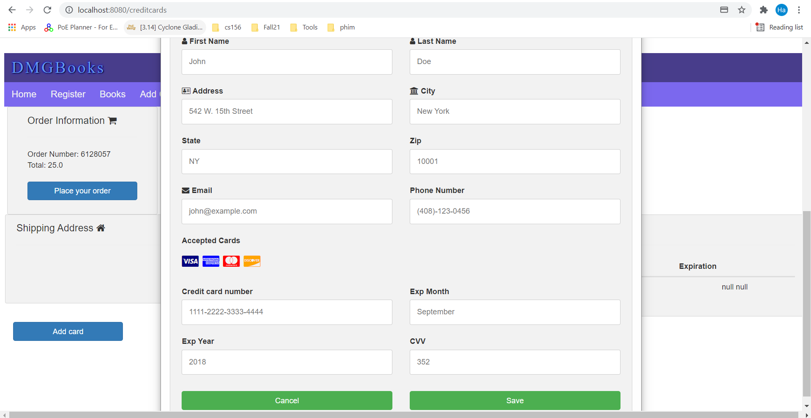

&nbsp;

* Take user's info

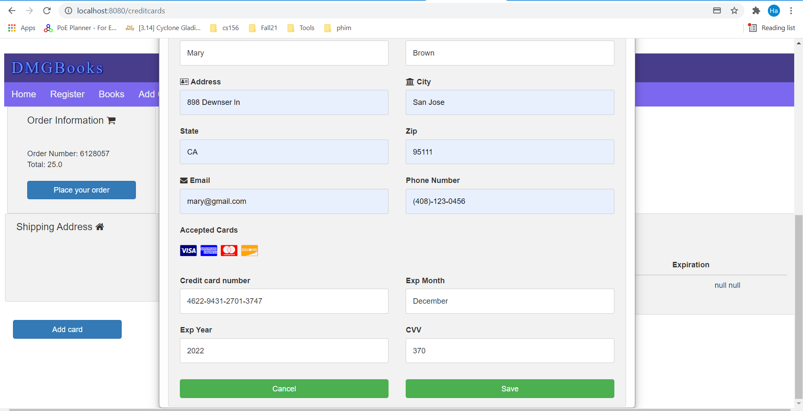

&nbsp;

* Add card result

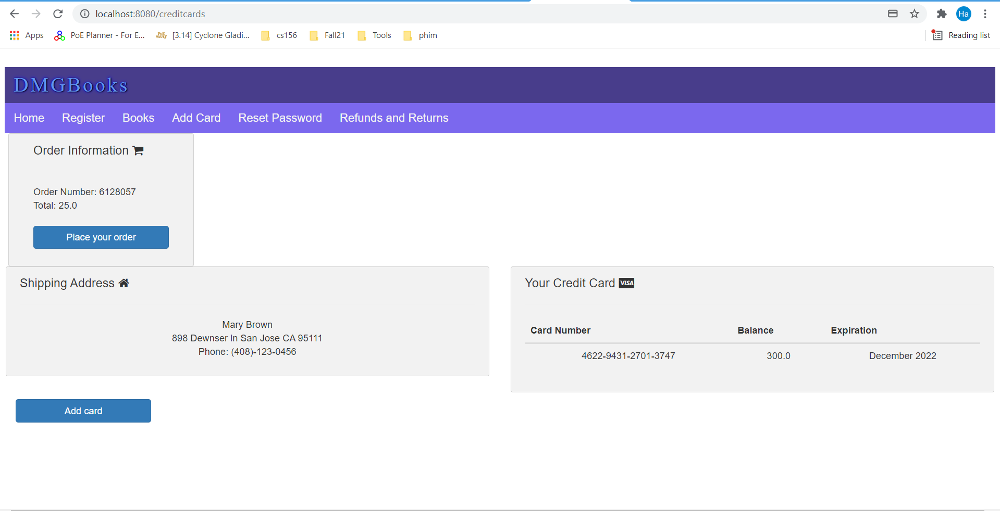

&nbsp;

* Save card's info in DB

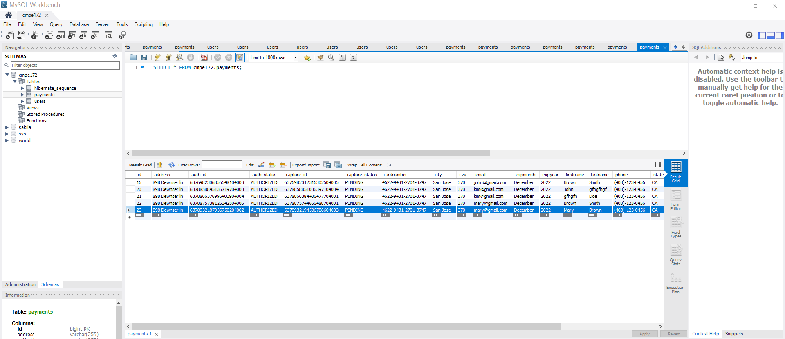

&nbsp;

* Place order

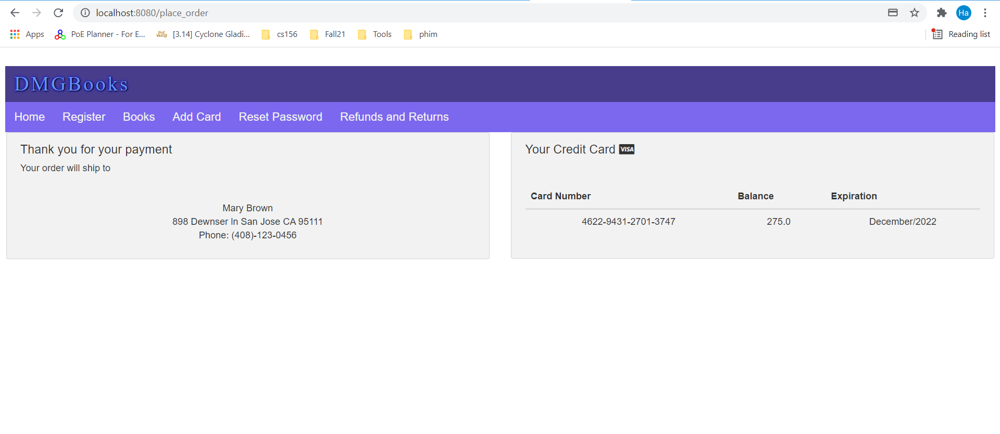

&nbsp;

### Day : 11/28/2022

* Merge Rhea branch to main
* Fixing login and register navigation
* Redirect to catalog page after logged in success

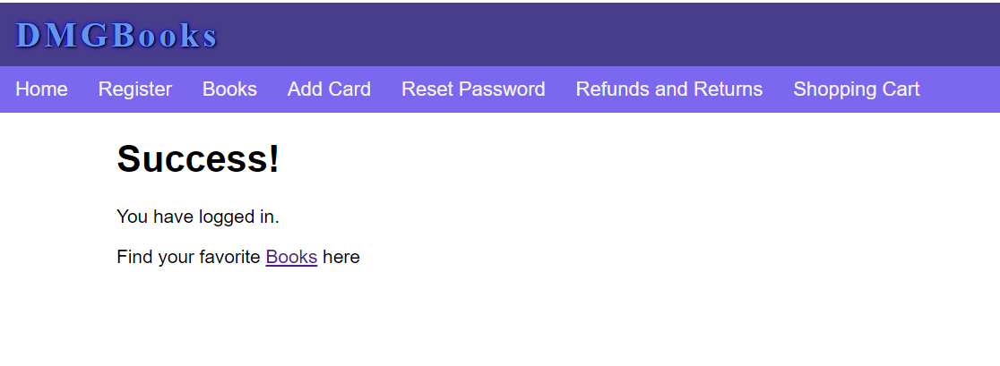

&nbsp;

* Edit home view 
* Register here and Reset here redirect to the correct views.

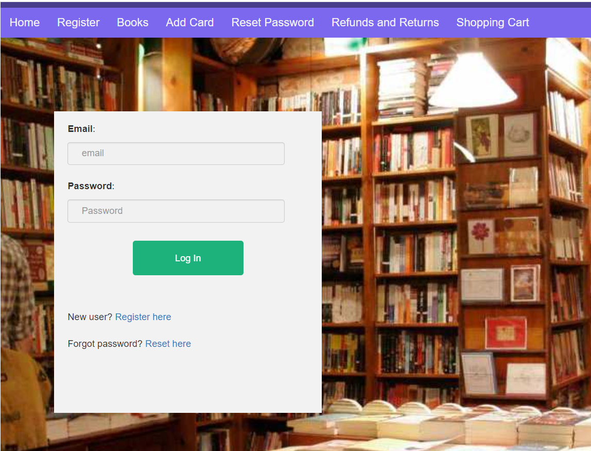

&nbsp;

* Login again navigation

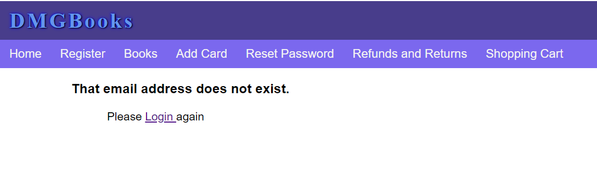

&nbsp;

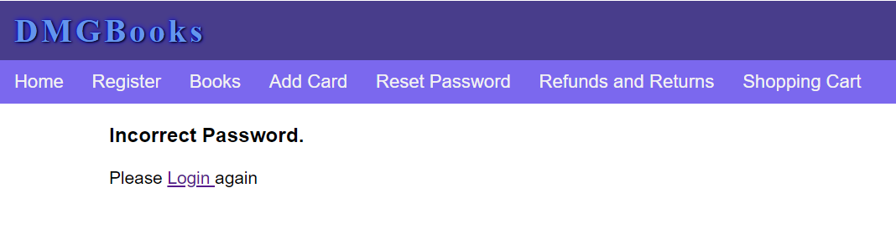

&nbsp;

* register form and navigate to login page

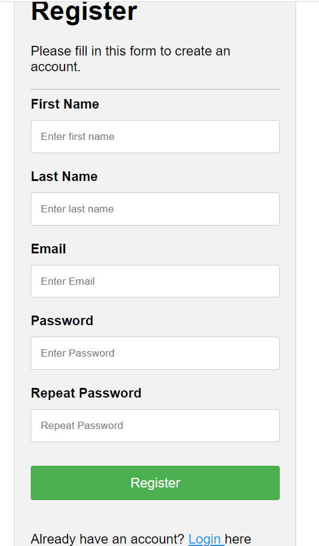

&nbsp;

* register again navigation

  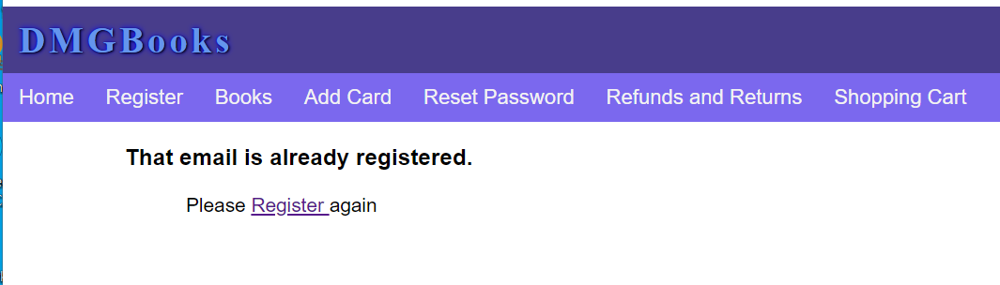

&nbsp;

* register success navigation

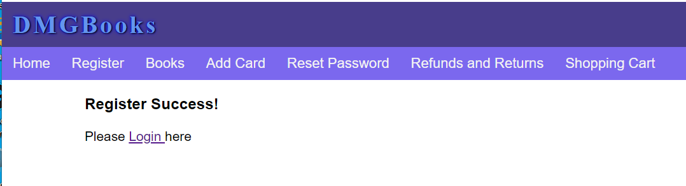

&nbsp;

* Reset password

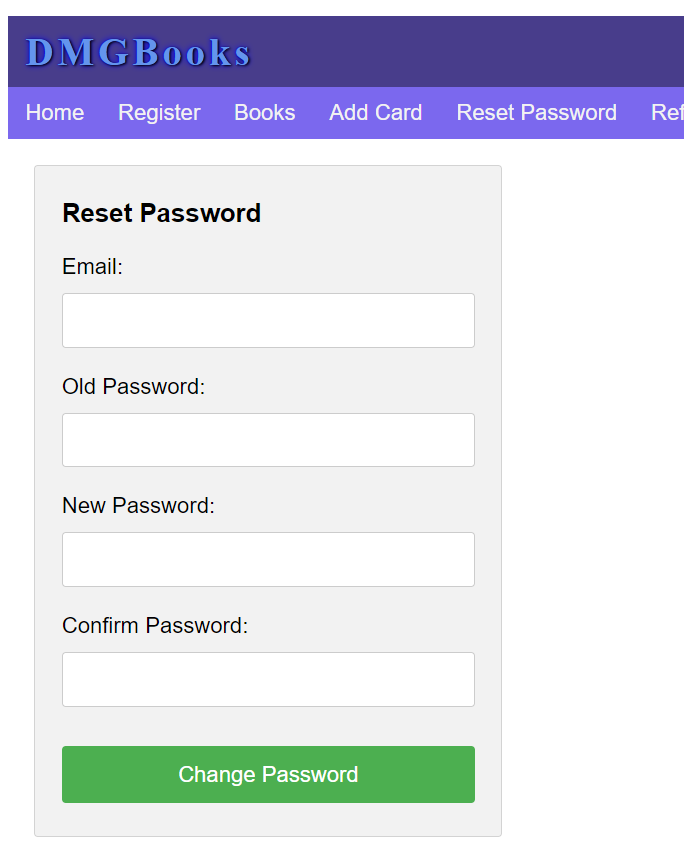

&nbsp;

##### Spring RestTemplate
* Reference from Rhea's finding: https://howtodoinjava.com/spring-boot2/resttemplate/spring-restful-client-resttemplate-example/
* What is RestTemplate
  * a simplified way with default behaviors for performing complex tasks
  * RestTemplate class is a synchronous client and designed to call REST services
  * Used to consume/access the REST APIs inside a Spring application
  * Will be deprecated in the future versions

##### Update balance after placed an order to db
* Problem
  * Cannot show place_order view
  * ResponseEntity<PaymentsCommand> response = restTemp.getForEntity(SPRING_PAYMENTS_URI + "/place_order", command, PaymentsCommand.class);
     method RestTemplate.<T#1>getForEntity(String,Class<T#1>,Object...) is not applicable

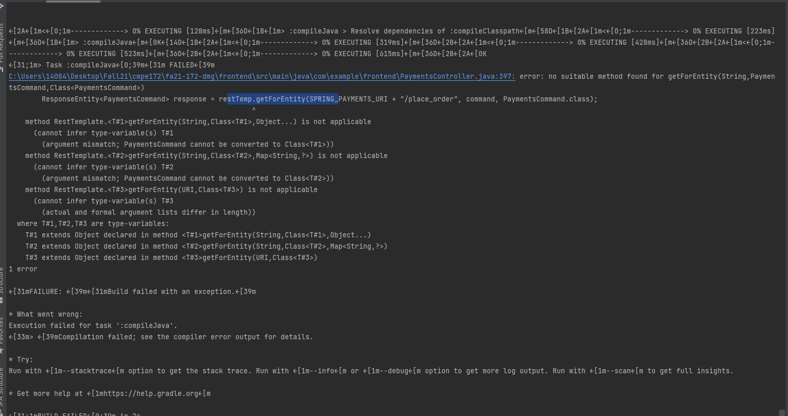

&nbsp;

* Solution
  * Using hidden from to get email and send back to the backend to update the balance in db
  
* Initial Balance
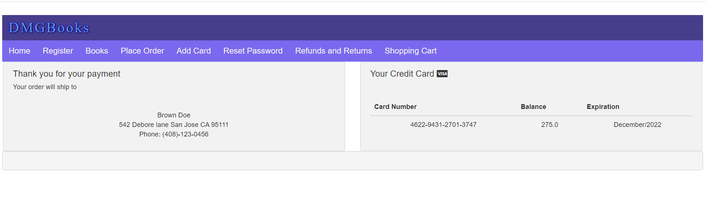

&nbsp;

* Balance after place an order
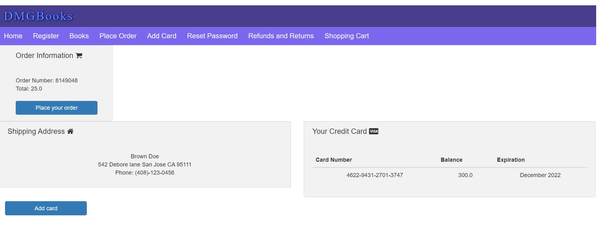

&nbsp;

* Updated balance in db
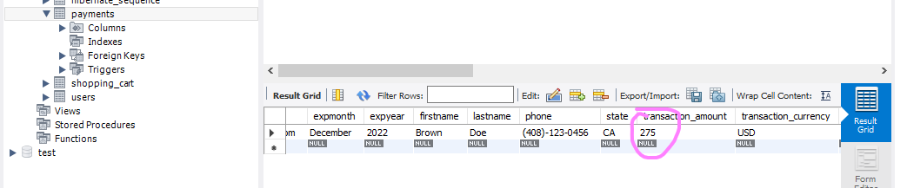

&nbsp;

### Day : 11/29/2022
* Task done and pick up new task

  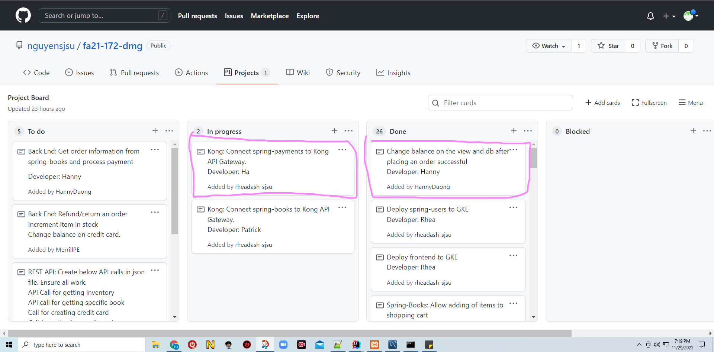

&nbsp;

### Day : 11/30/2022
* Task done and change task
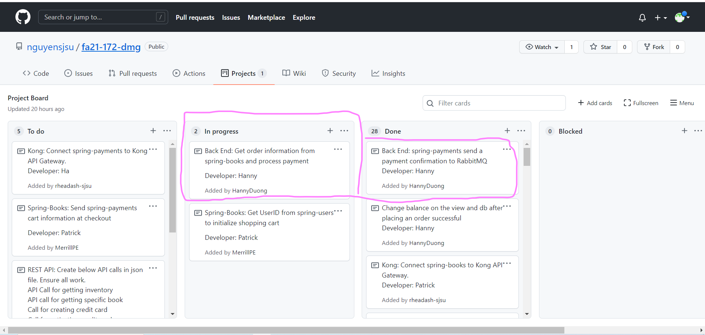

&nbsp;

#### RabbitMQ 

* Create a docker network: docker network create --driver bridge springdemo
* Run RabbitMQ: docker run --name rabbitmq --network springdemo -p 8088:15672 -p 4369:4369 \
  -p 5672:5672 -d rabbitmq:3-management
* Create a sender message in spring-payments: RabbitMqSender.java

* Sending a payment confirmation to RabbitMQ for spring-books
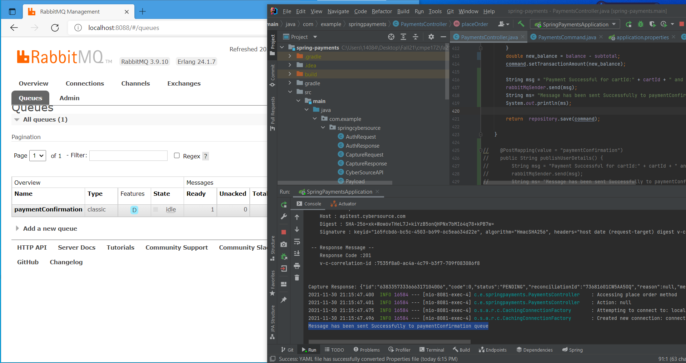

&nbsp;

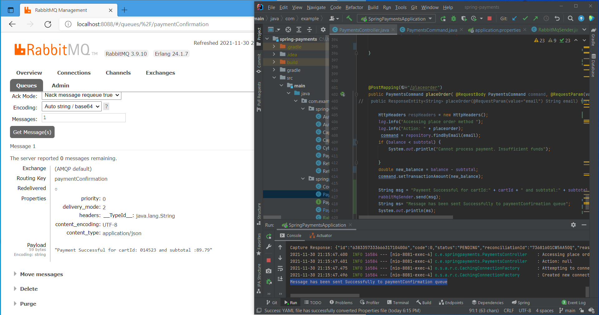

&nbsp;

### Day : 12/1/2022

##### REST APIs
* Reference: https://idratherbewriting.com/learnapidoc/docapis_introtoapis.html
* REST APIs consist of requests to and responses from a web server.
* A web service is a web-based application that provides resources in a format consumable by other computers
  * Web services are basically request-and-response interactions between clients and servers
    * A computer- the client- requests a resource
    * The web service- the API server- responds to the request
* All APIs that use HTTP protocol as the transport format for request and responds are considered web services
* Each programming language that makes the request will have a different way of submitting a web request and parsing the response in its language.
* REST is a style not a standard protocol
* Most REST APIs use JSON as the default message format.
* REST focus on resources and way to access the resources through URLs rather than actions
* The endpoint shows the whole path to the resource
  * A URL usually contains three parts:
    * The **base path** or base URL or host. EX: http://localhost:8080
    * The **endpoint** refers to the end path of the endpoint: EX: http://localhost:8080/home
      * /home is the endpoint
    * The **query parameters** for the endpoint.
      * The query parameters specify more details about the representation of the resource you want to see
      * EX: http://localhost:8080/home{home id }
  * What is transferred back from the server to the client is the representation of the resource
* Usually, you use HTTP protocol-http://- to submit a GET request to the resource available on a web server.
  * The response from the server sends the content at this resource back to you using HTTP.
  * Your browser is just a client that makes the message response look pretty.
* REST APIs are stateless and cacheable
  * Cacheable: If the browser's cache already contains the information asked for in the request,
    the browser can just return the information from the cache instead of getting the resource from the server again.

&nbsp;

* Sample requests through Postman: https://idratherbewriting.com/learnapidoc/docapis_postman.html
*  For example, if an endpoint looks like this: https://api.openweathermap.org/data/2.5/weather?zip=95050&units=imperial&appid=APIKEY 
    * Query string parameters appear after the question mark ? symbol and are separated by ampersands &.
    * The order of query string parameters doesn't matter.

&nbsp;

* JSON is the most common format for responses from REST APIs and
  fits much better into the existing JavaScript, HTML, css when parsing through the response
* JSON has two types of basic structures: objects and arrays
  * Object is a collection of key-value pairs, surrounded by curly braces
  * Array is a list of items, surrounded by brackets

##### Getting a specific property from a JSON response object
* Select the exact property you want and pull that out through dot notation
  * The dot(.) after the name of the JSON payload

* Type of parameters:
    * header parameters: included in the request header, usually related to authorization
    * path parameters: parameters within the path of the endpoint, before the query string(?)
      * Usually set off with curly braces, colon or a different syntax
    * query string parameters: parameters in the query string of the endpoint, after the (?)
    * body parameters
  
* Request bodies
  * With POST requests-where you're creating something- you submit a JSON object in request body

  
------------------------------------------
* Using Spring ResponseEntity to manipulate the HTTP Response
* Reference: https://www.baeldung.com/spring-response-entity
* ResponseEntity represents the whole HTTP response: status code, headers, and body.
  * We can use ResponseEntity to configure the HTTP response

--------------------------------
### Day : 12/2/2022

##### Test spring-payments API on Postman
* Get total and order number from shopping cart

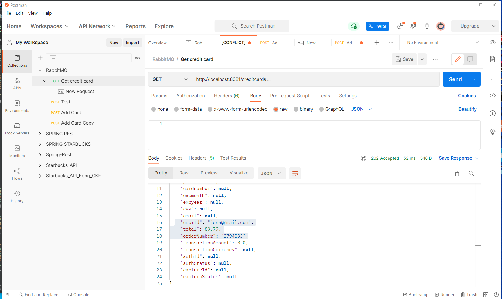

&nbsp;

* Add a card

&nbsp;

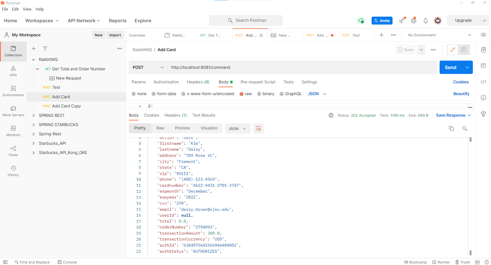

&nbsp;

* Place an order param

 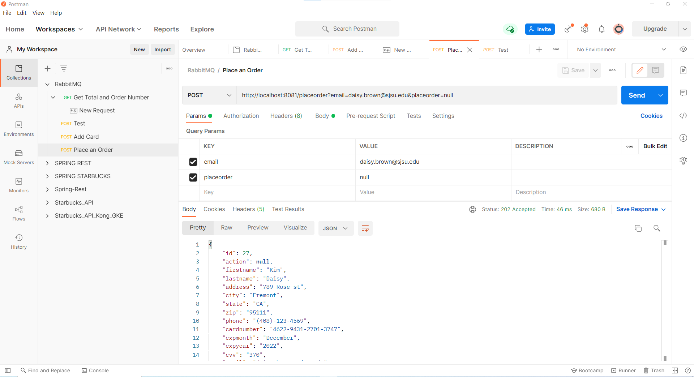

&nbsp;

* Place order body
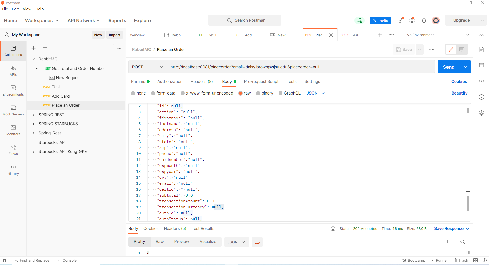

&nbsp;

* Place order response
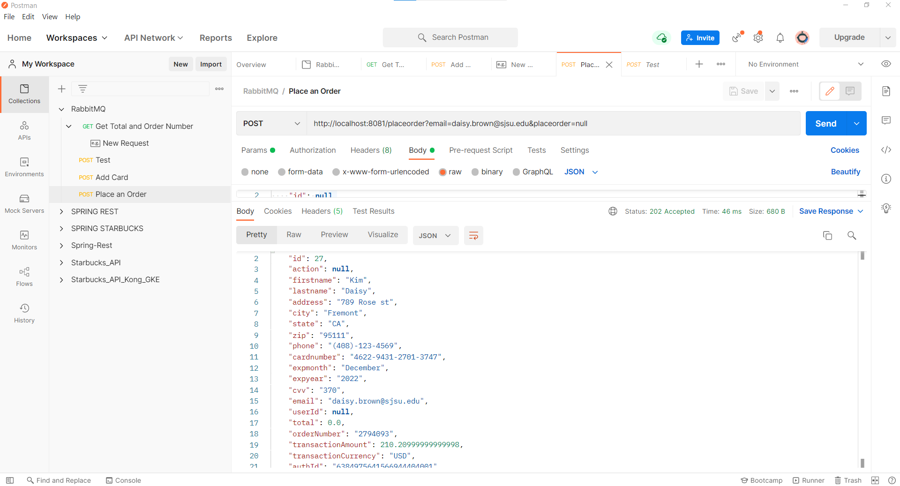

&nbsp;

--------------------------------
#### Test with curl
* Ping 
  * curl --location --request GET 'http://localhost:8081/ping'
  * curl --location --request GET 'http://localhost:8081/creditcards?email=mary@gmail.com'
  * curl --location --request POST 'http://localhost:8081/command' \
> --header 'Content-Type: application/json' \
> --data-raw '{
>     "id": null,
>     "action": "Save",
>     "firstname": "Kim",
>     "lastname": "Daisy",
>     "address": "789 Rose st",
>     "city": "Fremont",
>     "state": "CA",
>     "zip": "95111",
>     "phone": "(408)-123-4569",
>     "cardnumber": "4622-9431-2701-3747",
>     "expmonth": "December",
>     "expyear": "2022",
>     "cvv": "370",
>     "email": "daisy.brown@sjsu.edu",
>     "cartId": " null",
>     "subtotal": 0.0,
>     "transactionAmount": 0.0,
>     "transactionCurrency": null,
>     "authId": null,
>     "authStatus": null,
>     "captureId": null,
>     "captureStatus": null
> }'

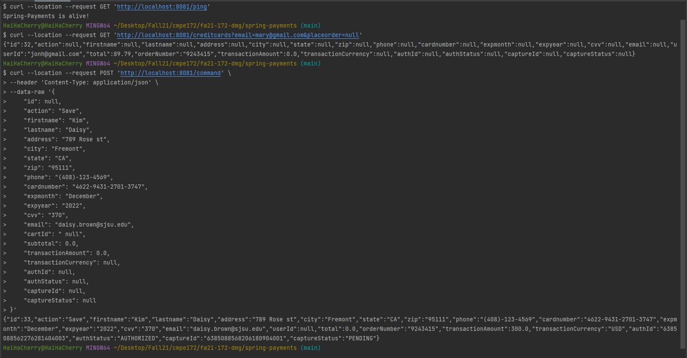

&nbsp;

* curl --location --request POST 'http://localhost:8081/placeorder?email=mary@gmail.com&placeorder=null'

 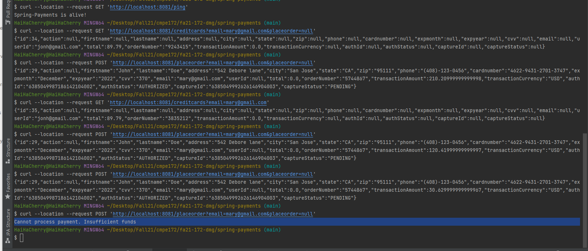
  
&nbsp;

curl_test_1

-------------------------

* Deploy the app to Docker
* Pull mysql image
  * docker run -d --name mysql -td -p 3306:3306 -e MYSQL_ROOT_PASSWORD=cmpe172 mysql:8.0 
* Access mysql container
  * docker exec -it mysql bash
  * mysql --password
  * cmpe172
* Create three databases:
  * create database springusers; 
  * create database springbooks;
  * create database springpayments;
* Create user:
  * create user 'springuser'@'%' identified by 'ThePassword'; 
* Gives all privileges
    * grant all on springusers.* to 'springuser'@'%';
    * grant all on springbooks.* to 'springuser'@'%';
    * grant all on springpayments.* to 'springuser'@'%';

* create user 'springpayment'@'%' identified by 'ThePassword';
* grant all on springpayments.* to 'springpayment'@'%';

* create user 'springbook'@'%' identified by 'ThePassword';
* grant all on springbooks.* to 'springbook'@'%';