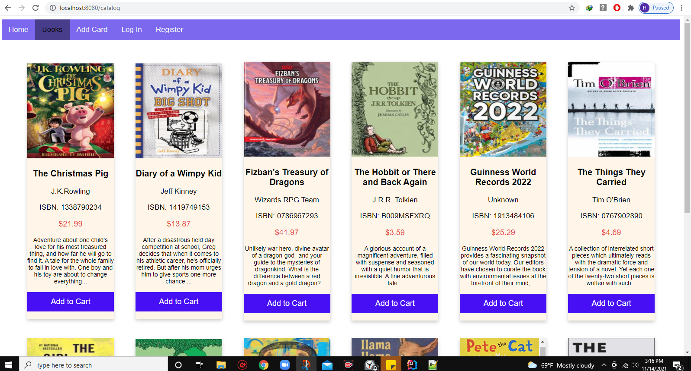

# Ha's Journal

## Week 1 

#### Day: 11/08/2021

* Works:
    * Reorganize project journal
#### Day: 11/13/2021
    
* Update project board and pick up some tasks for this week

&nbsp;

* Draw a simple class diagram

&nbsp;

* Draw a state diagram 
 

&nbsp;

* Issue: cannot display local images to the catalog page
* Solution: move the images' folder from templates to static folder
* spring-payments/src/main/resources/static/images

* Working on catalog page

&nbsp;

* Create Config.java for routing between pages
* Create navigation.html
  * Challenge: losing css style of navigation.html when insert to catalog.html
  * Solution: need to add th:fragment attribute in header of navigation.html also
  * Reference : https://www.baeldung.com/spring-thymeleaf-fragments

&nbsp;

## Week 2

#### Day: 11/14/2021
* Finish style catalog page

&nbsp;

* Pick new task

&nbsp;

