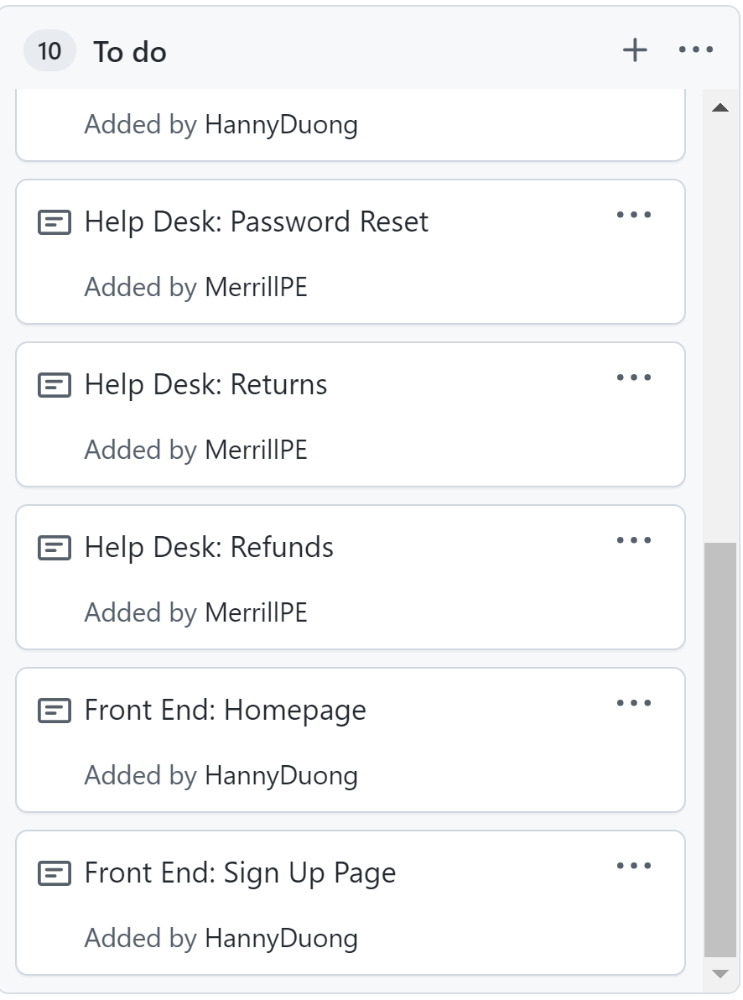

# Rhea's Journal

## Week 1

### November 8

Today, I pushed starter code for our project, copied from Labs 6 and 7, to make setting up the object models and Cybersource Payment Gateway simpler later on. I also created some bare-bone templates for our front end pages, particularly the home, registration, and login pages. Right now they do not have any functionality, but they are ready to be expanded on.

My task:

[My commit](https://github.com/nguyensjsu/fa21-172-dmg/commit/ce91cf02daecc39a9424f7f29f1c6e757c287939)

### November 9

I added another template for the catalog front-end page, and created starter files for handling the Book object.

My task:

[My commit](https://github.com/nguyensjsu/fa21-172-dmg/commit/0f5394a36cc3597018581f0fe3f0ee9d2772ab38)

## Week 2

### November 16

I added two more templates, for the password reset page and the refund page. 

My next task will be adding the back end support for resetting passwords.

My changes:

[My commit](https://github.com/nguyensjsu/fa21-172-dmg/commit/67c1d610a932215575b247d63144d5debc5e3997)

My task:

### November 20

I have created my own branch to do some test implementation. Currently my team and I are trying to decide whether to split our source code into 3 folders or 1, and I am testing whether implementing in one folder is feasible. 

[My commit](https://github.com/nguyensjsu/fa21-172-dmg/commit/1d2ef67a0420178ea9e42120a8b78bf7dd775231)

(later)

I have also implemented the registration & login backend. Now users can create an account and login. 

[My commit](https://github.com/nguyensjsu/fa21-172-dmg/commit/357db383d9f201f86ee577356b77c53c0ed0baf8)

My task:

## Week 3

### November 24

In my own branch, I separated the html templates into their own frontend folder, and edited the docker-compose.yaml files so that I can deploy the frontend and my own spring-users microservice on separate ports. I also added REST API calls for the frontend to communicate with the backend. I now have the frontend and the login/registration backend running on separate ports, and able to communicate. 

[My task](https://github.com/nguyensjsu/fa21-172-dmg/blob/main/Journal/rhea_journal/images/nov-24-tasks.JPG)

[My commit](https://github.com/nguyensjsu/fa21-172-dmg/commit/e3f84627b80654e5d5cba07b20793e60cb6bdcd8)
[My commit #2](https://github.com/nguyensjsu/fa21-172-dmg/commit/71fbbfa7734a7dc6c8171b1bda5977f05dfade92)
[My commit #3](https://github.com/nguyensjsu/fa21-172-dmg/commit/d32dac2ba9e19ce4c3970fbb617dac9371d9abf2)

Docker deployment below

