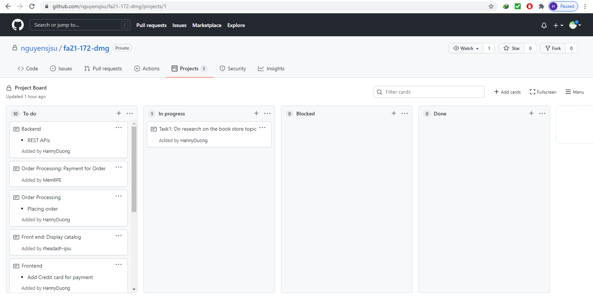
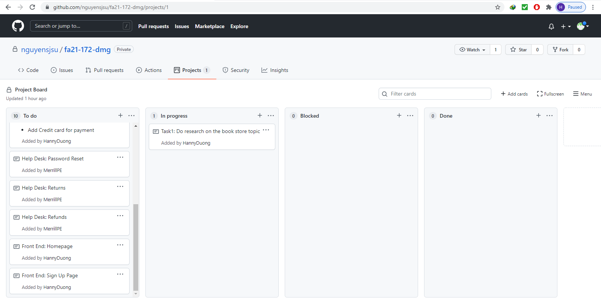
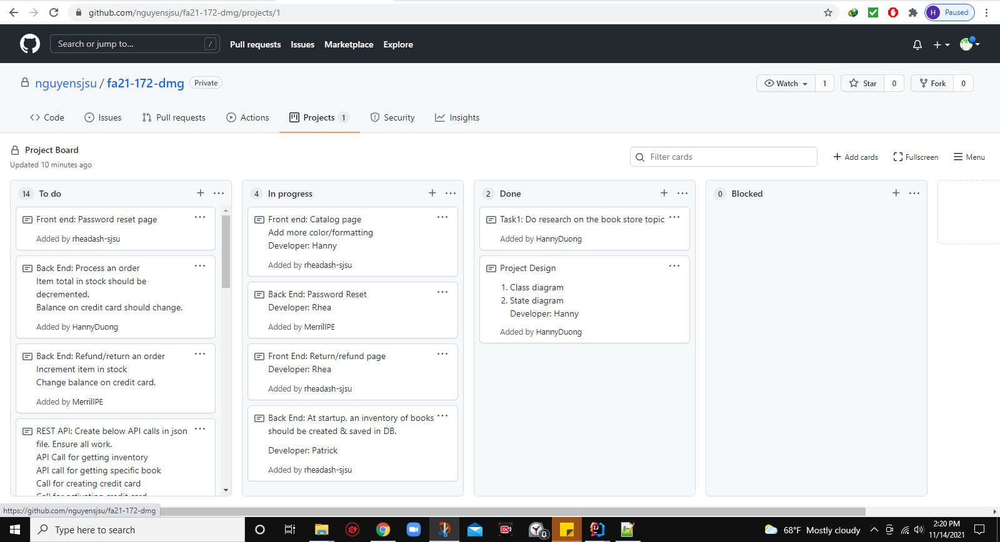

# Team Project (Book Store)

## Week 1( 11/07.2021)  
* Team meeting: 2:00 pm - 2:30pm
### Topic Choosing
* Options:
  1. Starbuck
  2. Book Store
* Chosen topic: Book Store
* Tasks to do this week
  1.  Do more research on book store
  2.  Work on the frontend
  3.  Create team Task Board

* Project Board

&nbsp;

&nbsp;

## Week 2 : 11/14/2021
* Team meeting: 2:00 pm - 2:30pm
#### Team Discussion:
  * Using Kong gateway for API calls
  * Using RabbitMQ 
  * Create separate databases for user and catalog
  * RabbitMQ can be used between placing an order, calculating price, and processing a payment.
  * Updated project Board

#### Tasks division
* Team members pick up tasks

&nbsp;

