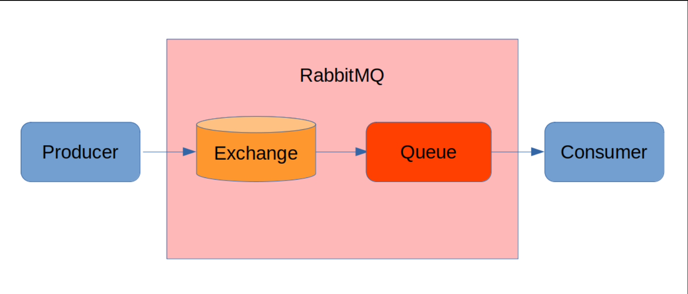

# Team Project (DMGBooks )

San Jose State University Computer Engineering Fall 2021  

Written by: 

*Rhea Dash

*Ha Duong  

*Patrick Merrill

### Introduction
 The project aims to build a Google Cloud Hosted Enterprise Application for a fictious Corporation
 to support the order and payment processing for buying books at DMGBooks.
 

### Project Demo

### Book Store App

* Home page

&nbsp;

* Register page

&nbsp;

* Login Success

&nbsp;

* Catalog page

&nbsp;

&nbsp;

* Shopping Cart page

&nbsp;

* Creditcards page

&nbsp;

* Credit card info

&nbsp;

* Initial balance

&nbsp;

* Credit card Register Success in Cybersource

&nbsp;

&nbsp;

* Card Details

&nbsp;

&nbsp;

&nbsp;

* Place an order

&nbsp;

* Message to RabbitMQ

&nbsp;

* Password reset

&nbsp;

### Project Notes

#### Functional Requirements

Front Office Portal: 
A "Front Office" Web Application that allows customers to sign-up for accounts, browse product catalog, place, and pay for orders using credit cards.
Back Office Portals: 
One "Back Office" Web Applications that supports customers reset password
REST APIs: 
Back Office and Front Office Applications integrate with "Backends" using REST APIs.

#### Technical Requirements

* The application was implemented in Java Spring and be deployable as Docker Containers on Google Cloud VM's and/or Kubernetes Engine (GKE).
* The source code is hosted in an assigned Team Repository in CMPE172 GitHub Organization.
*  All team members were committing work to GitHub.
*  Making weekly Individual Status Reports as (Markdown GitHub Files) at:
### Team Journal
[Team Journal](https://github.com/nguyensjsu/fa21-172-dmg/blob/main/Journal/team_journal/README.md)

### Individual Member Journals 
[Rhea's journal](https://github.com/nguyensjsu/fa21-172-dmg/blob/main/Journal/rhea_journal/rhea.md)

[Ha's journal](https://github.com/nguyensjsu/fa21-172-dmg/blob/main/Journal/ha_journal/ha.md)

[Patrick's journal](https://github.com/nguyensjsu/fa21-172-dmg/blob/main/Journal/patrick_journal/patrick.md)

*   Along with using GitHub's Team Task Board to track our progress.
*  https://github.com/nguyensjsu/fa21-172-dmg/projects/1

#### Software Stack & Tools
* Spring Framework (Spring MVC, Spring JPA, Etc...) for
 * Back Office Portal
 * REST APIs
 * Front Office Portal using Thymeleaf
* Development Tools
 * Gradle 5.6
 * Version of Java should be JDK 11
 * Database & Middleware Requirements
   * MySQL Database 8.0
   * RabbitMQ
   * Kong API Gateway
 * Credit Card Payments Support
   * Integration with CyberSource Payment Gateway

#### What is KONG API Gateway?

* KONG API Gateway is a simple way to configure public-facing endpoints to ensure efficient for microservices architecture
* Reference: https://konghq.com/learning-center/api-gateway/api-gateway-uses/
* A microservice-based system can consist of several of individual services.
* Direct client-to-microservices communication means exposing the APIs for each microservice.
* API gateway is an alternative to direct client-to-microservice communication.
* A **gateway acts as an abstraction layer** for your microservices and provides a **single point of entry** for consumers of your application.
* API gateway:
  * is the abstraction of the backend microservices.
  * acts as a proxy for application's microservices
  * exposing the public-facing API endpoints
  * routing incoming client requests to the relevant services
  * is the single point of entry to your system
    * restrict access to your microservices from the outside world
    * reducing the potential attack
  * has the ability to scale services independently according to load
  * provides load balancing to ensure even or weighted distribution of incoming requests across the available instances of service.

* If the system serves multiple types of clients, it may be appropriate to provide multiple API gateways based on those types

#### RabbitMQ
* Reference:https://springframework.guru/spring-boot-messaging-with-rabbitmq/
* RabbitMQ is a common messaging broker which allows applications to connect and communicate
* RabbitMQ is a common services in microservices-based systems to communicate asynchronously through messaging.
  * to send and receive message for inter-service communication.
* A message sender sends a message to the message broker.
* The broker stores the message until a message receiver application connects and consume the message.
* This image shows how messages are communicated in RabbitMQ

&nbsp;

